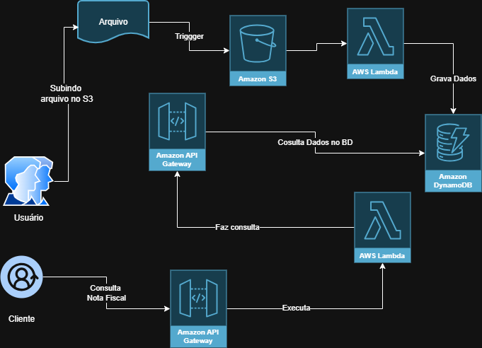
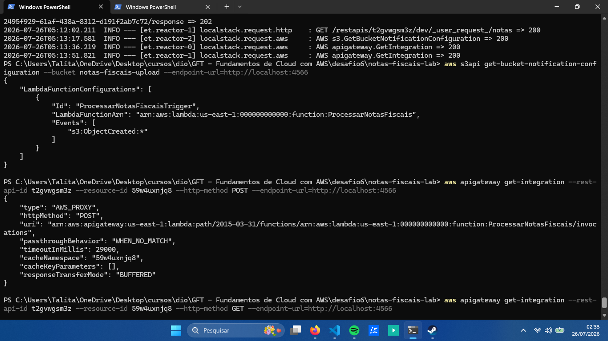
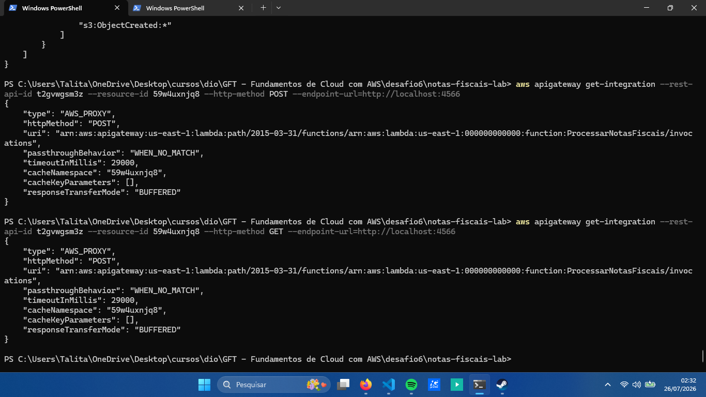
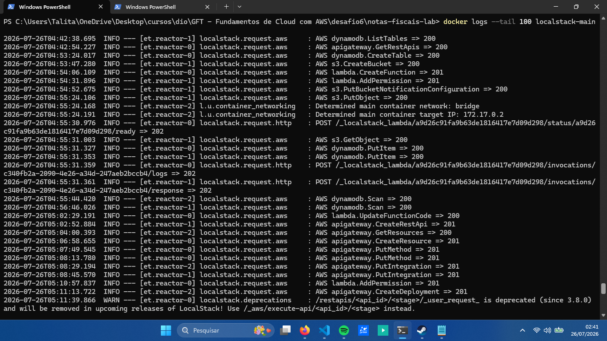
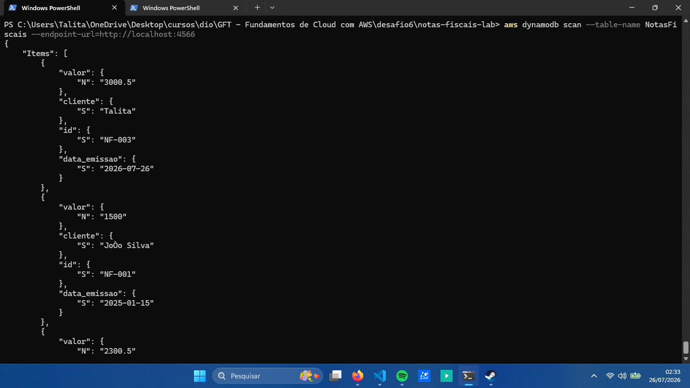
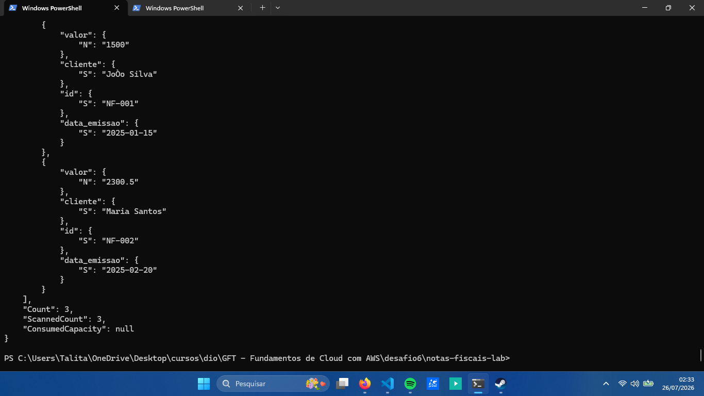
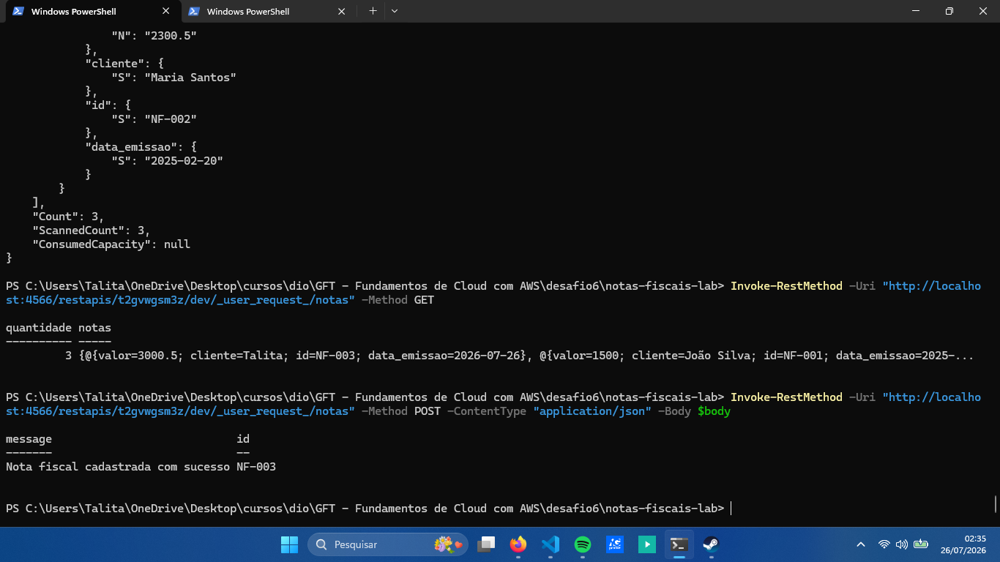

# Executando Tarefas Automatizadas com Lambda Function e S3

> Projeto desenvolvido durante o **Bootcamp GFT - Fundamentos de Cloud com AWS da DIO**, utilizando o **LocalStack** para simular serviços da AWS em ambiente local.

## 📖 Descrição

Neste projeto foi desenvolvida uma arquitetura serverless para processar notas fiscais em formato JSON.

A solução utiliza:

- Amazon S3
- AWS Lambda
- Amazon DynamoDB
- Amazon API Gateway
- LocalStack
- AWS CLI
- Docker

O projeto possui dois fluxos principais:

1. O envio de um arquivo JSON ao S3 dispara automaticamente a função Lambda, que grava as notas no DynamoDB.
2. A API Gateway permite cadastrar novas notas com o método POST e consultar os registros com o método GET.

---

## 🏗️ Arquitetura



---
## 🛠️ Tecnologias e serviços utilizados

- AWS CLI
- LocalStack
- Docker Desktop
- PowerShell
- Python
- AWS Lambda
- Amazon S3
- Amazon DynamoDB
- Amazon API Gateway
---

## 📂 Estrutura do Projeto
---
.
├── grava_db.py
├── gerar_dados.py
├── lambda_function.zip
├── notification_roles.json
├── notas_fiscais_2025.json
├── README.md
│
├── docs/
│   └── logs-localstack.txt
│
└── imagens/
    ├── diagrama-estrutura.png
    ├── 01-configuracao-trigger-s3.png
    ├── 02-integracao-api-post-get.png
    ├── 03-dynamodb-notas-cadastradas.png
    ├── 04-dynamodb-notas-cadastradas2.png
    ├── 05-testes-api-get-post.png
    ├── 06-lambda-localstack.png
    ├── 07-api-gateway-detalhes.png
    └── 08-api-gateway-metodos.png
---

## 🚀 Etapas Desenvolvidas

- Preparação do ambiente com Docker, LocalStack e AWS CLI;
- Criação do bucket S3 e da tabela no DynamoDB;
- Desenvolvimento e configuração da função Lambda;
- Configuração do trigger do S3 para executar a Lambda;
- Envio e processamento do arquivo JSON;
- Criação da API REST no API Gateway;
- Configuração dos métodos GET e POST;
- Integração da API com a Lambda;
  
---

## ⚙️ Funcionamento

### S3, Lambda e DynamoDB

O arquivo `notas_fiscais_2025.json` é enviado para o bucket `notas-fiscais-upload`.

O evento `s3:ObjectCreated:*` executa a função Lambda `ProcessarNotasFiscais`, que lê o arquivo e grava as notas na tabela `NotasFiscais` do DynamoDB.



### API Gateway

A API `NotasFiscaisAPI` possui o recurso `/notas` com dois métodos:

- `POST /notas`: cadastra uma nova nota fiscal;
- `GET /notas`: consulta as notas cadastradas.





---

## 🧪 Testes

A consulta realizada no DynamoDB confirmou o armazenamento de três notas fiscais.





Os métodos GET e POST também foram testados pelo PowerShell. O GET retornou as notas armazenadas e o POST cadastrou uma nova nota com sucesso.



---

## 📋 Logs

Os logs completos do LocalStack estão disponíveis no arquivo:

[Visualizar logs do LocalStack](docs/logs-localstack.txt)

Os registros mostram o processamento do arquivo no S3, a execução da função Lambda, as gravações no DynamoDB e as requisições GET e POST da API.

---

## ✅ Resultado

Foram validados os dois fluxos da aplicação:

```text
S3 → Lambda → DynamoDB
```

```text
API Gateway → Lambda → DynamoDB
```

O arquivo enviado ao S3 foi processado automaticamente, e a API permitiu cadastrar e consultar notas fiscais.

---

## 📚 Conclusão

O projeto permitiu praticar a criação e a integração de serviços AWS em ambiente local utilizando LocalStack, Docker e AWS CLI.

Também foi possível compreender melhor o funcionamento de eventos do S3, funções Lambda, armazenamento de dados no DynamoDB e criação de APIs REST com API Gateway.

---

## 👩‍💻 Autora

**Talita**
- Testes pelo PowerShell e validação pelos logs do LocalStack.

